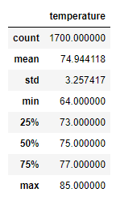

# Surf's up!

## Overview
This analysis of weather in Oahu supports our business plan for a new surf gear rental and ice cream shop on the island. Our hope is to add to the businesses 
serving the surfers &mdash; both local and tourists &mdash; who congregate on Oahu, while also providing frosty treats to them and their non-surfing companions. 

## Results
- Temperatures on Oahu average in the mid-70s in June and only a few degrees cooler in December.
- December may be a bit cool to spend much time in the water. Our data shows a minimum observed temperature of 56 degrees in December, when temperatures appear 
to more frequently hit the 60s.
- A maximum observed temperature of 85 degrees in June suggests that the weather is rarely too hot to enjoy the beach. 

### June temperature statistics

### December temperature statistics

## Summary
Oahu's temperate weather is clearly one reason why surfers flock to the island. However, in order to better serve surfers and maximize our business opportunity, we 
should make sure to offer high-quality wetsuit rentals, as temperatures below the 70s could deter surfers who are not properly outfitted. But even the most extreme 
temperatures observed in our data set are pleasant for outdoor recreation and make for good ice cream-eating weather. 

Another factor to consider is precipitation. Two quick queries of our database show that December is rainier than June. Rain combined with cooler temperatures 
could mean slower business for our shop, although the coldest, wettest weather Oahu has to offer is probably more attractive than winter in much of the rest of 
the Northern Hemisphere.

